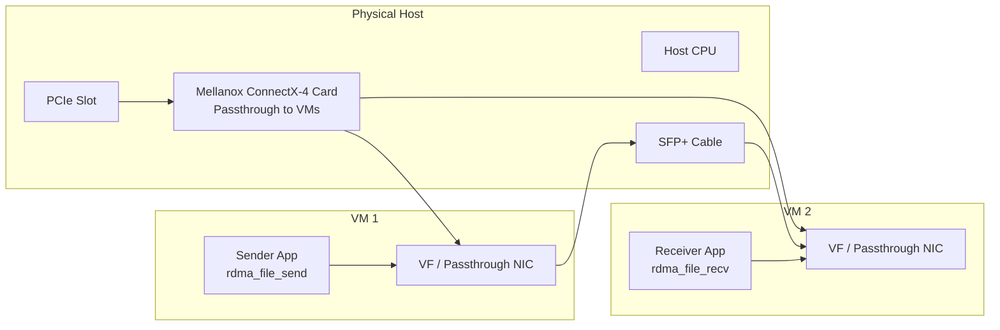
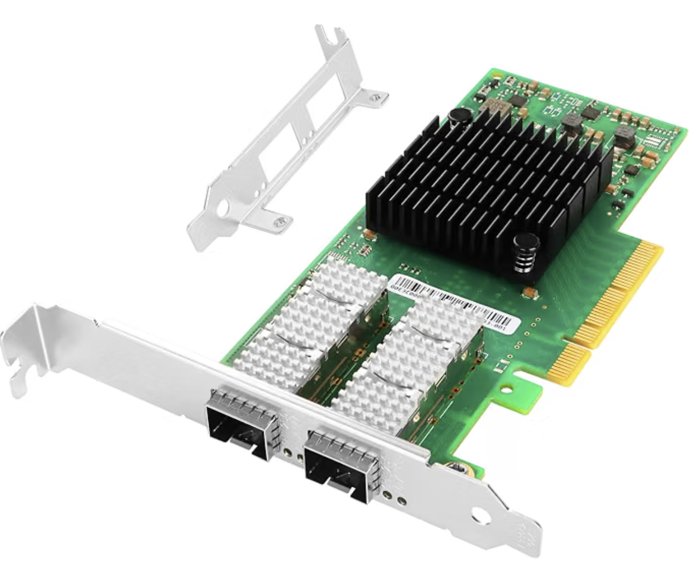
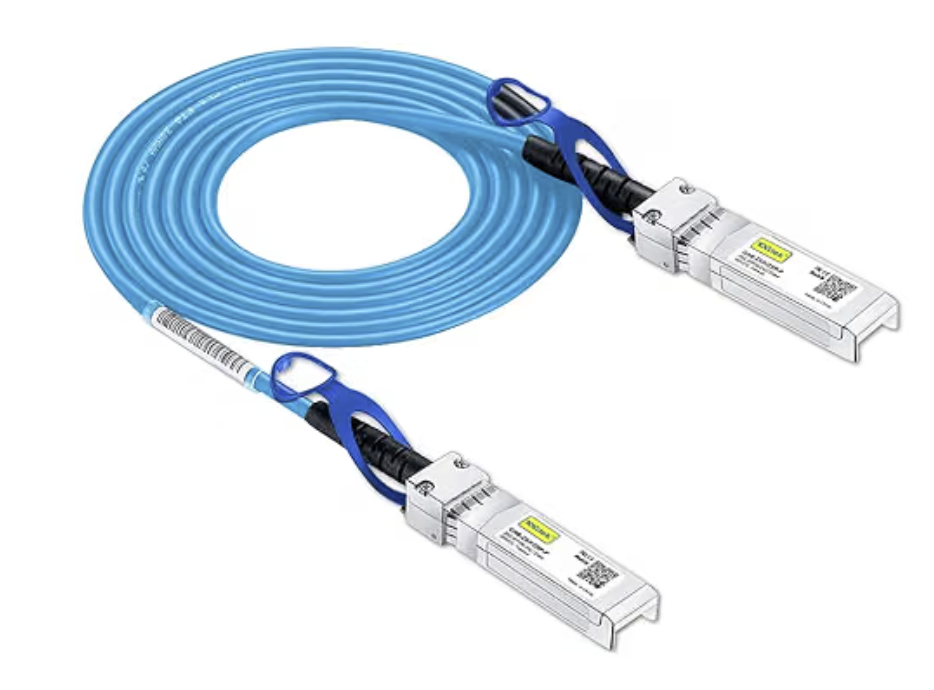
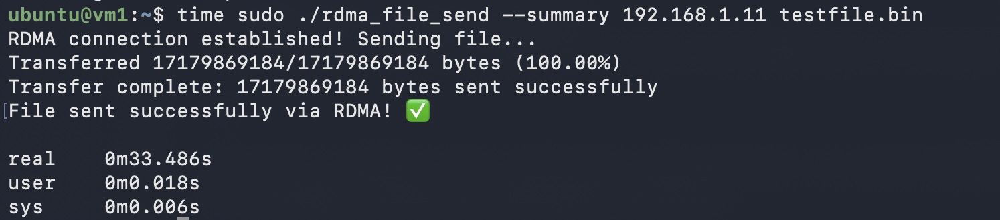

# RDMA File Transfer over Mellanox ConnectX-4

This directory contains a small RDMA-based file transfer example for moving large files directly between two Linux hosts or VMs using a Mellanox ConnectX-4 card and a direct SFP connection.

The project includes:

- `rdma_file_send.c` — sender side
- `rdma_file_recv.c` — receiver side
- `rdma_pingpong.c` — basic RDMA ping-pong test
- `rdma_write_bw.c` — bandwidth test
- `rdma_read_lat.c` — latency test
- `Makefile` — builds the Linux RDMA tools
- `RDMA_GUIDE.md` — detailed RDMA reference and background

This README is intended as a practical getting-started guide for hardware installation, driver setup, and file transfers.

---

## 1. Hardware setup

### Physical hardware layout

The setup below shows the recommended physical arrangement: a host machine with a Mellanox PCIe card passed through to two VMs, with each VM using one of the RDMA-capable ports over an SFP cable.



### Hardware photos





---

## 2. Install the Mellanox card and SFP cable

Follow this procedure on the physical host:

1. Power off the system before inserting the card.
2. Open the chassis and locate a free PCIe x8 or x16 slot with enough airflow.
3. Insert the Mellanox ConnectX-4 card firmly into the slot.
4. Secure the bracket and confirm the card is seated properly.
5. Connect the SFP+ cable to the Mellanox port.
6. If using a direct cable between two machines or VMs, ensure both ends are connected to compatible ports.
7. Boot the system and check that the card is visible in the PCI bus:

```bash
lspci | grep -i mellanox
lspci | grep -i mellanox
```

8. Verify the NIC link status after boot:

```bash
ip link
ibstat
ibv_devinfo
```

9. If the link is down, check:
   - SFP module compatibility
   - cable seating and polarity
   - proper PCIe slot seating
   - firmware version of the card
   - port configuration and link settings in the BIOS / host setup

> For a direct point-to-point RDMA connection, both endpoints must be configured consistently and the Mellanox card must have the correct kernel drivers and firmware loaded.

---

## 3. Install the RDMA drivers

The Mellanox card requires the correct RDMA drivers before the `ibv_*` tools and the examples in this directory can work.

### Option A: Use the Mellanox OFED stack (recommended)

Download the OFED package from NVIDIA/Mellanox and install it on the Linux box.

```bash
wget <MLNX_OFED_PACKAGE_URL>
chmod +x MLNX_OFED_LINUX-*.tgz
sudo tar -xf MLNX_OFED_LINUX-*.tgz -C /tmp
cd /tmp/MLNX_OFED_LINUX-*
sudo ./mlnxofedinstall --upstream-libs --dpdk --force
sudo /etc/init.d/openibd restart
```

Then verify the device is detected:

```bash
ibv_devinfo
ibstat
```

### Option B: Use the Ubuntu/Debian inbox drivers

On Ubuntu or Debian systems, install the core RDMA packages:

```bash
sudo apt update
sudo apt install -y build-essential gcc make linux-headers-$(uname -r) \
    rdma-core libibverbs-dev librdmacm-dev ibverbs-utils infiniband-diags
```

Then check the adapter:

```bash
ibv_devinfo
```

### Driver validation

The following commands confirm that the card is correctly installed and the RDMA stack is active:

```bash
ibv_devinfo
ibstat
cat /sys/class/infiniband/*/ports/1/state
```

If the ports are not active, inspect the driver and firmware status first.

---

## 4. Build the example programs on Linux

The examples in this folder are meant to be compiled on a Linux machine with RDMA libraries available.

### Copy the project to the Linux box

Use your Linux VM or server and copy the directory:

```bash
scp -r /path/to/rdma user@linux-host:/home/user/
```

Then build:

```bash
cd ~/rdma
make
```

The Makefile in this directory builds the example programs, including:

```bash
make rdma_file_send
make rdma_file_recv
```

For detailed background, references, and additional RDMA setup information, consult [RDMA_GUIDE.md](RDMA_GUIDE.md).

---

## 5. Create a large sample file

To validate large transfers, create a sample file of a few GBs:

### Example: 4 GiB file

```bash
dd if=/dev/zero of=/tmp/sample_4G.bin bs=1M count=4096 status=progress
```

### Example: 16 GiB file

```bash
dd if=/dev/zero of=/tmp/sample_16G.bin bs=1M count=16384 status=progress
```

You can also use `truncate` if a sparse file is enough:

```bash
truncate -s 16G /tmp/sample_sparse_16G.bin
```

> Use real data when validating checksums. For a more realistic test, prefer generating a file with random or compressed data.

---

## 6. Run the server and the client

This project uses a sender and a receiver. One machine acts as the server and the other is the client sender.

### Receiver side (server)

Run the receive program first:

```bash
cd ~/rdma
./rdma_file_recv --summary /tmp/received.bin
```

Optional progress flags:

```bash
./rdma_file_recv --verbose /tmp/received.bin
./rdma_file_recv --quiet /tmp/received.bin
```

### Sender side (client)

Now send the file from the other machine or VM:

```bash
cd ~/rdma
./rdma_file_send --summary 10.0.0.2 /tmp/sample_4G.bin
```

Optional progress flags:

```bash
./rdma_file_send --verbose 10.0.0.2 /tmp/sample_4G.bin
./rdma_file_send --quiet 10.0.0.2 /tmp/sample_4G.bin
```

### Example end-to-end flow

On the receiver:

```bash
./rdma_file_recv --summary /tmp/received.bin
```

On the sender:

```bash
./rdma_file_send --summary 192.168.1.20 /tmp/sample_4G.bin
```

### Validate correctness

After transfer, compare the file size and checksum:

```bash
ls -lh /tmp/received.bin
md5sum /tmp/received.bin /tmp/sample_4G.bin
```

The MD5 values should match for a correct transfer.

### Transfer result screenshot



---

## 7. Useful checks and troubleshooting

### Verify link state

```bash
ibstat
ibv_devinfo
ip link show
```

### Verify ports

```bash
cat /sys/class/infiniband/*/ports/1/state
```

### Check current RDMA interfaces

```bash
ls /sys/class/infiniband
```

### Confirm the Mellanox card is seen by the kernel

```bash
dmesg | grep -i -E 'mlx|mellanox|ib'
```

### If the transfer stalls or fails

1. Check whether the cables are fully seated.
2. Confirm both machines see the Mellanox device.
3. Verify `ibv_devinfo` reports a valid port state.
4. Make sure the IP addresses are reachable between the sender and receiver.
5. Rebuild and rerun the example from a clean Linux environment.
6. Start with a smaller file to confirm the connection is working.

---

## 8. Notes

- This project is intended for Linux hosts with RDMA-capable devices.
- This directory is designed around the Mellanox ConnectX-4 / libibverbs workflow.
- For deeper information about RDMA concepts, queue pairs, memory registration, GID selection, and performance tuning, refer to [RDMA_GUIDE.md](RDMA_GUIDE.md).
- The project is best validated on a real Linux RDMA host or VM with direct hardware passthrough and a working Mellanox NIC.

---

This file is meant to be a practical starting point. It can be expanded later with host-specific tuning, VLAN or RoCE config, or an example production deployment workflow.
